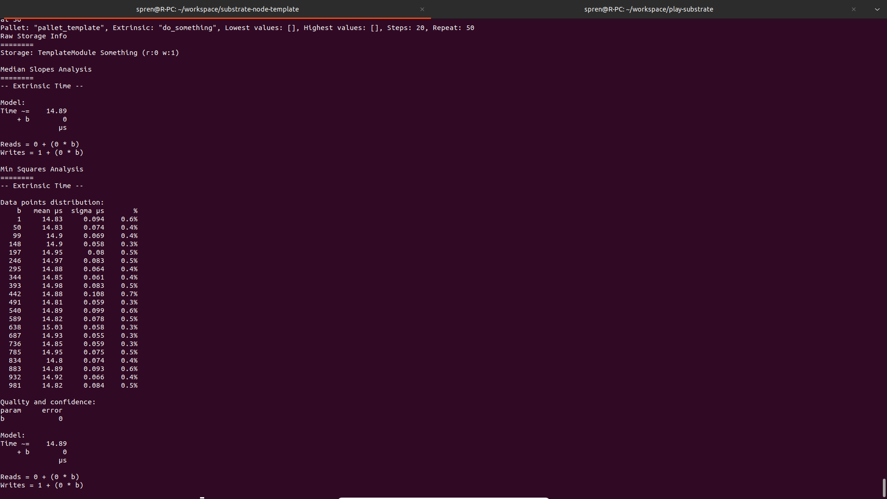
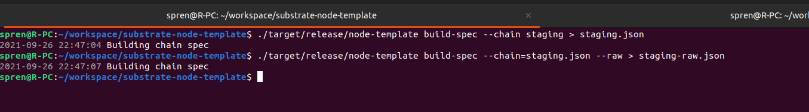

## 1 为 template 模块的 do_something 添加 benchmark

添加文件：benchmarking.rs 及 weights.rs，并在 do_something 前添加宏：

```rust
#[pallet::weight(T::WeightInfo::do_something(*something))]
```

进行 benchmark，运行结果如下图：


## 2 使用 node-template 生成 Chain Spec 文件（两种格式）

此过程我并没有将 PoA 切换为 PoS 以及 去除 Sudo 模块，而是直接使用 node-template 进行修改，代码增加如下内容：
chain_spec.rs

```rust
pub fn public_testnet_config() -> Result<ChainSpec, String> {
	let wasm_binary = WASM_BINARY.ok_or("Public testnet was not available")?;
	let boot_nodes = vec![];

	Ok(ChainSpec::from_genesis(
		"Public Testnet",
		"my_testnet",
		ChainType::Live,
		move || public_testnet_genesis(wasm_binary),
		boot_nodes,
		Some(
			TelemetryEndpoints::new(vec![(STAGING_TELEMETRY_URL.to_string(), 0)])
				.expect("My testnet telemetry url is valid; qed"),
		),
		Some("my_testnet"),
		None,
		Default::default(),
	))
}

fn public_testnet_genesis(wasm_binary: &[u8]) -> GenesisConfig {
	let endowed_accounts = vec![
		// 5FemZuvaJ7wVy4S49X7Y9mj7FyTR4caQD5mZo2rL7MXQoXMi
		hex!["9eaf896d76b55e04616ff1e1dce7fc5e4a417967c17264728b3fd8fee3b12f3c"].into(),
		// 5FNrxGpnd3z5NTBEFDarNeCCYYx2Fw7DFbsXv1VuwmNXQsNW
		hex!["928dbd595055b13e3606618516e69d60ea4d8861f0f1c632cf9f503c45f24717"].into(),
		// 5DknRrEh2khKAiEV9rFFGJLiQQahSJZ7hTYPQNfYmxFsLHQr
		hex!["4acd70cdbe4a0ab21e96615e1d3f7f809d44ceb169d19232327dc71819451c6e"].into(),
		// 5E4gXxnM9oC16VCfiL2rGbYhie9B1W8unKpQ2HPzj2EqoGJL
		hex!["587403d0dbdc7d12ce2a4da526b18df0a3b5c7c2074464c4879ef47b42769b2d"].into(),
	];

	let initial_authorities: Vec<(AccountId, AccountId, AuraId, GrandpaId)> = vec![
		(
			// 5Grpw9i5vNyF6pbbvw7vA8pC5Vo8GMUbG8zraLMmAn32kTNH
			hex!["d41e0bf1d76de368bdb91896b0d02d758950969ea795b1e7154343ee210de649"].into(),
			// 5DLMZF33f61KvPDbJU5c2dPNQZ3jJyptsacpvsDhwNS1wUuU
			hex!["382bd29103cf3af5f7c032bbedccfb3144fe672ca2c606147974bc2984ca2b14"].into(),
			// 5Dhd2QbrSE4dyNn3YUg8j5TY3fG7ZAWZMoRRF9KUc7VPVGmC
			hex!["48640c12bc1b351cf4b051ac1cf7b5740765d02e34989d0a9dd935ce054ebb21"]
				.unchecked_into(),
			// 5C6rkxAZB437B5Bf1yS4B4qjW4HZPeBp8Kzx2Se9FLKhfyHY
			hex!["01a474a93a0cf830fb40b1d17fd1fc7c6b4a95fa11f90345558574a72da0d4b1"]
				.unchecked_into(),
		),
		(
			// 5CFDk3yCSgQ2goiaksMfRMFRS7ZU28BZqPQDeAsgZUa6FRzt
			hex!["08050f1b6bcd4651004df427c884073652bafd54e5ca25cea69169532db2910b"].into(),
			// 5F1ks2enazaPktQa3HURLK8GywzNZaGirovPtFvvbv91TLhJ
			hex!["8275157f2a1d8373106cb00078a73a92a3303f3bf6eb72c3a67413bd943b020b"].into(),
			// 5CQ7gVQj96m8y79qPCqrM291rSNREfZ1Tf2fiLPSJReWTNy2
			hex!["0ecddcf7643a98de200b80fe7b18ebd38987fa106c5ed84fc004fa75ea4bac67"]
				.unchecked_into(),
			// 5FyNaMc6GaioN7K9QzPJDEtGThJ1HmcruRdgtiRxaoAwn2VD
			hex!["acdfcce0e40406fac1a8198c623ec42ea13fc627e0274bbb6c21e0811482ce13"]
				.unchecked_into(),
		),
		(
			// 5F6YideXfGcskpdFUczu3nZcJFmU9WKHgjjNVQjqgeVGRs66
			hex!["861c6d95051f942bb022f13fc2125b2974933d8ab1441bfdee9855e9d8051556"].into(),
			// 5F92x4qKNYaHtfp5Yy7kb9r6gHCHkN3YSvNuedERPHgrURTn
			hex!["8801f479e09a78515f1badee0169864dae45648109091e29b03a7b4ea97ec018"].into(),
			// 5CLqVJSpfAdMYW1FHygEV8iEi8XFornEcCzrhw9WmFbbp8Qp
			hex!["0c4d9de1e313572750abe19140db56433d20e4668e09de4df81a36566a8f2528"]
				.unchecked_into(),
			// 5HEQh8yEv4QU7joBCKYdjJJ57qU1gDAm4Xv5QZKfFnSbXpeo
			hex!["e493d74f9fa7568cca9dd294c9619a54c2e1b6bd3ecf3677fa7f9076b98c3fcd"]
				.unchecked_into(),
		),
		(
			// 5FxxpyvEnE2sVujvhr6x4A4G171uv4WKSLvrUNst9M8MfdpV
			hex!["ac8fdba5bbe008f65d0e85181daa5443c2eb492fea729a5981b2161467f8655c"].into(),
			// 5FxFAYsTNf31D5AGbXW9ETZPUZofpreHjJkdKehidcvDt5X4
			hex!["ac039bef73f76755d3747d711554f7fb0f16022da51483e0d600c9c7c8cbf821"].into(),
			// 5GdjiBeMEFqTE6mWod3UqPrtkQTscRGtAcmdSbR26vGiXpwB
			hex!["ca2245b6fa117fab9353a2031104d1d5d62e311957f375762324e65d71127465"]
				.unchecked_into(),
			// 5DMfkaaR4tzmarUsRMkrbnFNmVnYtYjTPFJsjvA4X15WAZZB
			hex!["392c51bf0c08f89cb1e091782d81359475d780986968ba7f6fa60f41feda6bf7"]
				.unchecked_into(),
		),
	];

	GenesisConfig {
		system: SystemConfig {
			// Add Wasm runtime to storage.
			code: wasm_binary.to_vec(),
			changes_trie_config: Default::default(),
		},
		balances: BalancesConfig {
			// Configure endowed accounts with initial balance of 1 << 60.
			balances: endowed_accounts.iter().cloned().map(|k| (k, 1 << 60)).collect(),
		},
		aura: AuraConfig {
			authorities: initial_authorities.iter().map(|x| (x.2.clone())).collect(),
		},
		grandpa: GrandpaConfig {
			authorities: initial_authorities.iter().map(|x| (x.3.clone(), 1)).collect(),
		},
		sudo: SudoConfig {
			// Assign network admin rights.
			key: get_account_id_from_seed::<sr25519::Public>("Alice"),
		},
	}
}

```

command.rs

```rust
  ...
	fn load_spec(&self, id: &str) -> Result<Box<dyn sc_service::ChainSpec>, String> {
		Ok(match id {
			"dev" => Box::new(chain_spec::development_config()?),
			"" | "local" => Box::new(chain_spec::local_testnet_config()?),
			"staging" => Box::new(chain_spec::public_testnet_config()?),
			path => {
				Box::new(chain_spec::ChainSpec::from_json_file(std::path::PathBuf::from(path))?)
			}
		})
	}
  ...
```

生成结果存在文件 assets/staging.json 和 assets/staging-raw.json 中。

生成过程截图为：

